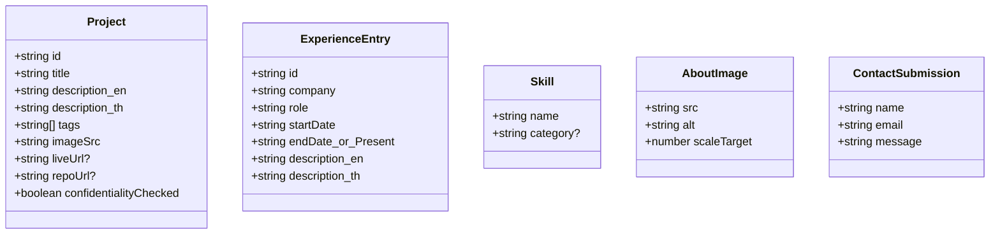

# Portfolio Website — Technical Blueprint

**Source:** [docs/PRD.md](PRD.md)

## 0. Locked Tech Stack

| Layer | Choice |
|---|---|
| Framework | **Next.js 14+ (App Router)** |
| Language | **TypeScript** |
| Styling | **Tailwind CSS** |
| Component library | **shadcn/ui** |
| Motion | **Framer Motion** |
| Theme (light/dark) | **next-themes** (standard shadcn/Tailwind pairing, respects `prefers-color-scheme`, persists via `localStorage`) |
| i18n (TH/EN) | Lightweight custom `LanguageProvider` (React Context) + JSON dictionaries (`en.json` / `th.json`) — the content volume (one-page site) doesn't justify a full i18n library like `next-intl`; revisit only if content grows significantly |
| Email delivery | **Resend** (Contact form → Next.js Route Handler → Resend API) |
| Database | **None.** Static/content-driven site; the only dynamic touchpoint is the Contact form, which is stateless (send-and-forget, no persistence) |
| Hosting | **Vercel (free tier)** — confirmed by owner; serverless Route Handler for `/api/contact` runs natively on Vercel's free plan, no extra config needed. Deployment pipeline specifics (env vars, custom domain, CI) are still `/devops`'s job — this just confirms the target platform the architecture above assumes |

## 1. Content/Data Model (Mermaid — not a database ER diagram)

There is no persistent database. This diagram represents the shape of the static content the site renders, defined as typed data files in the repo (`/content/*.ts`), not DB tables.



`ContactSubmission` is the one runtime (non-static) shape — it exists only as an in-flight request/response payload, never stored.

## 2. Content Data Schema (static files, not DB tables)

### `content/projects.ts` — `Project[]`
| Field | Type | Required | Notes |
|---|---|---|---|
| `id` | string | Yes | slug, e.g. `"weather-app"` |
| `title` | string | Yes | |
| `description_en` / `description_th` | string | Yes | short, per PRD §4 |
| `tags` | string[] | Yes | tech stack used |
| `imageSrc` | string (path under `/public`) | Yes | placeholder asset until owner supplies real screenshots |
| `liveUrl` | string (URL) | No | at least one of `liveUrl`/`repoUrl` present |
| `repoUrl` | string (URL) | No | |
| `confidentialityChecked` | boolean | Yes (defaults `false`) | author-side gate — build step or content review excludes any project where this is `false` **and** it's flagged as a current-employer project, per PRD §3.5 |

### `content/experience.ts` — `ExperienceEntry[]`
| Field | Type | Required |
|---|---|---|
| `id` | string | Yes |
| `company` | string | Yes |
| `role` | string | Yes |
| `startDate` | string (`YYYY-MM`) | Yes |
| `endDate` | string (`YYYY-MM`) \| `"present"` | Yes |
| `description_en` / `description_th` | string | Yes |

### `content/skills.ts` — `Skill[]`
| Field | Type | Required |
|---|---|---|
| `name` | string | Yes |
| `category` | string | No |

### `content/about-images.ts` — `AboutImage[]`
| Field | Type | Required | Notes |
|---|---|---|---|
| `src` | string | Yes (placeholder for now) | up to ~7 images, per the Zoom Parallax component referenced during brainstorming |
| `alt` | string | Yes | accessibility |
| `scaleTarget` | number | Yes | max scroll-linked scale factor per image (mirrors the `scale4`…`scale9` pattern from the reference component) |

### i18n dictionaries — `i18n/en.json`, `i18n/th.json`
Flat or nested key → string maps for all static UI copy (nav labels, section headings, button text, form labels/errors). Project/Experience bilingual fields live alongside their entries (above), not in these dictionaries, since they're content-specific rather than UI chrome.

## 3. API Contracts

Single endpoint. No auth, no database, no other backend surface.

### `POST /api/contact`

**Request body:**
```json
{
  "name": "string, required, 1-100 chars",
  "email": "string, required, valid email format",
  "message": "string, required, 1-2000 chars",
  "honeypot": "string, optional — must be empty; bot trap field, see §4"
}
```

**Success response — `200 OK`:**
```json
{ "ok": true }
```

**Validation error — `400 Bad Request`:**
```json
{ "ok": false, "error": "validation", "fields": { "email": "Invalid email address" } }
```

**Server/upstream error — `502 Bad Gateway`:**
```json
{ "ok": false, "error": "delivery_failed" }
```
(Resend call failed — client shows the retry-able inline error per PRD §5.)

**Rate-limited — `429 Too Many Requests`:**
```json
{ "ok": false, "error": "rate_limited" }
```

**Implementation notes:**
- Validate the request body with a `zod` schema (matches the table above) before touching Resend — this satisfies PRD §5's "empty field" / "invalid email" cases at the API boundary, not just client-side.
- Route Handler calls `resend.emails.send(...)` server-side only; `RESEND_API_KEY` lives in an env var, never sent to the client.
- On success, Resend sends the message to the owner's inbox; the API does not persist anything (no DB row, no log of message content beyond Resend's own dashboard).

## 4. Security & Authentication Setup

- **No user authentication anywhere** — every route is public; there's nothing to log into.
- **Contact form abuse prevention** (proportional to a portfolio's traffic/risk level — no need for full reCAPTCHA):
  - Honeypot field (hidden input real users never fill; if populated, silently return `200 OK` without sending an email — don't tip off bots that they were caught).
  - Basic IP-based rate limiting on `/api/contact` (e.g., a small in-memory or edge-config limiter — a few requests per IP per hour is generous for a real visitor and blocks naive spam scripts).
- **Input handling:** all contact form fields pass through the `zod` schema and are escaped/treated as plain text when interpolated into the outgoing email (no HTML injection into the email body).
- **Secrets:** `RESEND_API_KEY` — server-side environment variable only (`.env.local` in dev, host's secret manager in production). Never exposed via `NEXT_PUBLIC_*`.
- **CORS:** default same-origin is sufficient — the form only ever submits to its own domain's API route.

## 5. Technical Notes & Best Practices

- **Images:** use `next/image` throughout (Project screenshots, About/Zoom Parallax set) for automatic optimization and lazy-loading — keeps Hero's first paint fast per PRD §6 performance requirement, since below-the-fold images (especially the multi-image Zoom Parallax section) shouldn't block it.
- **Reduced motion:** wrap Framer Motion scroll-linked effects (Zoom Parallax, and whichever extra micro-interactions get added at `/dev` time) with a check against `useReducedMotion()` (Framer Motion's built-in hook for `prefers-reduced-motion`) — required by PRD §5/§6, not optional polish.
- **Theming:** `next-themes`'s `ThemeProvider` wraps the app; Tailwind's `dark:` variant classes carry the two palettes (`#F9F8F4`/`#30302E` light, `#262624`/near-white dark, `#D97757` accent in both). Contrast should be spot-checked (WCAG AA) once real components exist — flag this explicitly for `/uxui` and `/qa`, since the accent color is used for both decorative and text/icon purposes per PRD §6.
- **i18n mechanics:** `LanguageProvider` context stores the current language in `localStorage`; all page copy reads through a `t("key")`-style helper backed by `en.json`/`th.json`. Project/Experience bilingual fields are selected directly by current language from their own data files (no separate translation layer needed there).
- **Deferred UI decisions carried over from the PRD** (not re-litigated here — this Blueprint doesn't need to pick them, `/dev` does): which additional 21st.dev-style micro-interactions ship beyond Zoom Parallax (tilt cards, shiny buttons, marquee, bento grid, blur text reveal, animated grid/beam background, cursor spotlight, magnetic buttons).
- **Testing surface for `/qa`:** the only server-side logic worth unit/integration testing is the `/api/contact` Route Handler (validation branches, honeypot behavior, rate-limit behavior, Resend failure handling). Everything else is static rendering + client-side interaction, better suited to component/visual tests than backend-style test suites.
